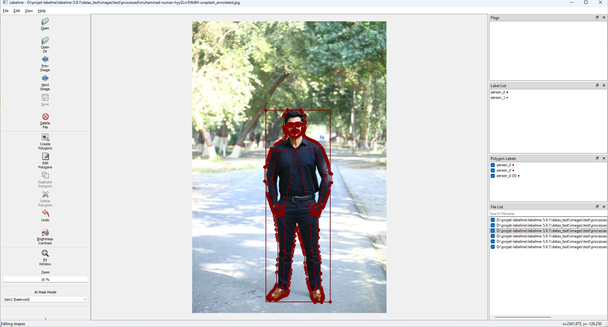
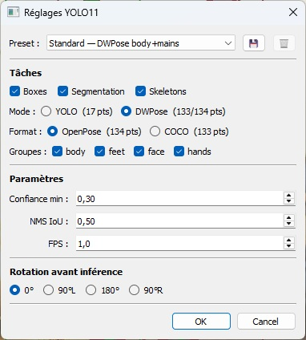
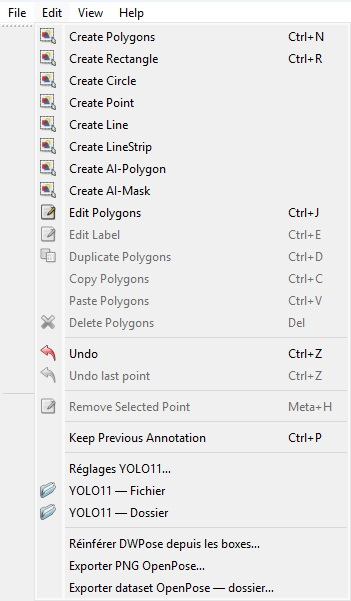
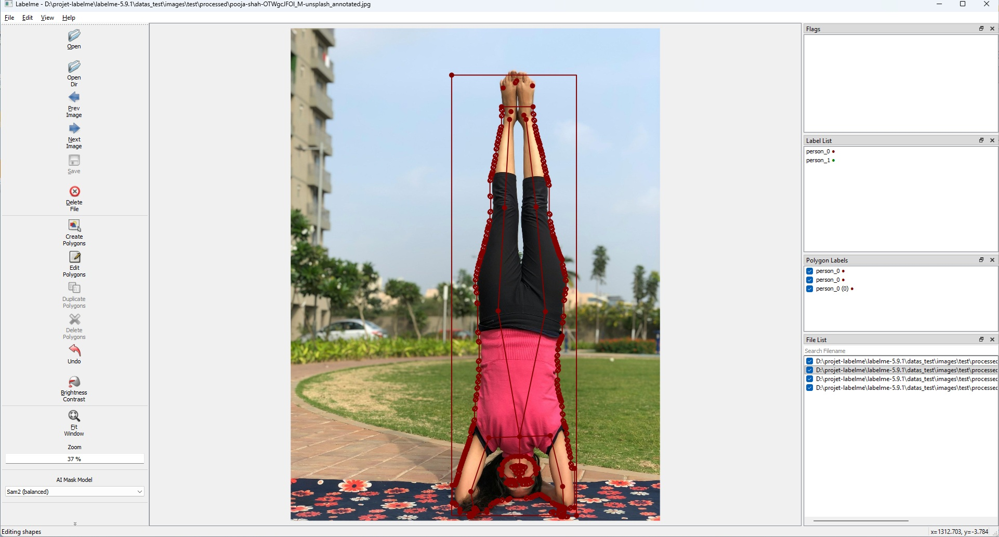
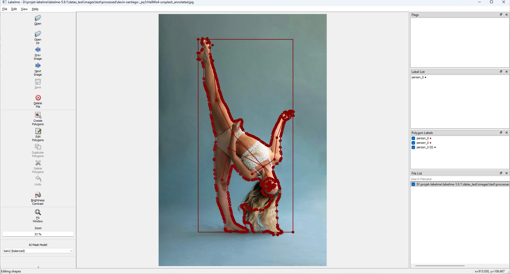
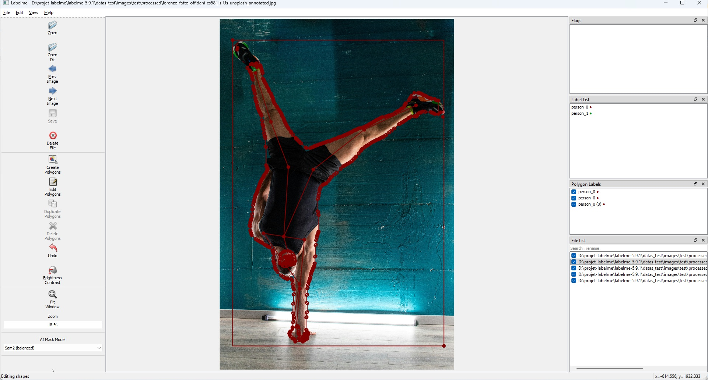
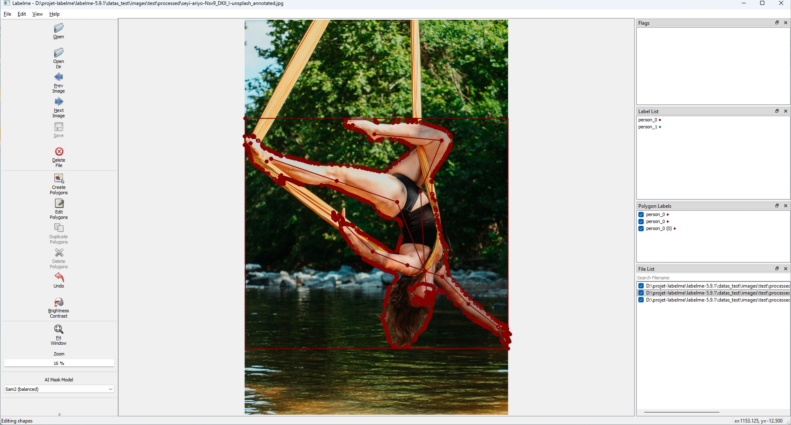

# LabelMe 5.9.1-Yolo-DWPose

[English](README.md) · [Interfaces d'intégration](INTERFACES.fr.md)

LabelMe pour l'annotation de pose — détection auto (YOLO11 + DWPose), rotation en option pour les poses non-standard, correction manuelle, export ControlNet-ready.



---

## Cas d'usage

- **Datasets ControlNet OpenPose pour ComfyUI** — génère des paires image/skeleton pour entraîner ou fine-tuner un ControlNet, avec correction manuelle sur les poses ratées par les modèles génériques
- **Pipelines d'animation / retargeting** — extrait le squelette 2D pour driver un mannequin 3D ou un avatar, en complément d'un workflow ComfyUI + AnimateDiff ou autre pipeline d'animation
- **Sport / danse / arts martiaux** — annote des séquences avec des poses non-standard (chutes, figures, mouvements techniques) que les modèles génériques de pose ratent, pour enrichir des datasets ControlNet spécialisés

---

## LabelMe officiel vs ce fork

| Fonctionnalité | LabelMe 5.9.1 (officiel) | LabelMe-Yolo-DWPose |
|---|---|---|
| Annotation manuelle (polygones, boxes, points) | ✅ | ✅ |
| Détection automatique (YOLO11) | ❌ | ✅ Boxes, segmentation, skeleton 17pts |
| Estimation de pose corps entier (DWPose) | ❌ | ✅ 133/134 pts |
| Gestion des sujets inversés/inclinés | ❌ | ✅ Rotation avant inférence |
| Ré-inférence ciblée depuis une box | ❌ | ✅ |
| Ajout/suppression de keypoints en masse | ❌ | ✅ Rubber-band, clic droit |
| Export direct OpenPose (PNG + JSON) | ❌ | ✅ Batch disponible |
| Traitement vidéo natif | ❌ | ✅ Tracking Kalman + preview mp4 |
| Pipeline scriptable (mode, skeleton, rotation, fps…) | ❌ | ✅ |

---

## Fonctionnalités

- **Détection automatique** — YOLO11 pour les boîtes englobantes, les masques de segmentation (compatible SAM2) et les skeletons COCO 17 pts
- **Intégration DWPose** — estimation de pose corps entier en 133 pts (COCO-WholeBody) ou 134 pts (OpenPose)
- **Groupes de keypoints configurables** — body, feet, face, hands — activez uniquement ce dont vous avez besoin
- **Rotation avant inférence** — 0° / 90°L / 180° / 90°R pour gérer les poses inversées ou inclinées
- **Export PNG OpenPose** — fond noir, skeleton arc-en-ciel + silhouette, mode batch disponible
- **Réinférence depuis les boxes** — redessinez une box et relancez DWPose sur une image sans repasser par tout le pipeline
- **Correction manuelle des keypoints** — plusieurs outils disponibles :
  - Clic droit sur un skeleton → **Ajouter un keypoint manquant** — active un point non détecté (était à [0,0]) et le place au centre du skeleton ; à vous de le faire glisser à la bonne position (repérage parfois délicat au milieu d'un cluster de points main/visage)
  - Clic droit directement sur un keypoint → **Supprimer** — le remet à [0,0]
  - **Ctrl+Alt+drag** (sélection rubber-band) — efface tous les keypoints dans la zone sélectionnée, peu importe le groupe. Pensé pour éviter de supprimer un par un sur les groupes à beaucoup de points (mains 21 pts, visage ~70 pts) ; sur les pieds (3 pts), la correction point par point reste suffisante
- **Presets** — sauvegardez et restaurez vos réglages d'inférence favoris

---

## Captures d'écran

### Panneau de réglages


### Menu Edition


### Pose standard — 0° (Muhammad Numan / Unsplash)


### Pose inversée — rotation 180° (Pooja Shah / Unsplash)

Le modèle s'attend à une tête en haut, des pieds en bas. La rotation avant inférence présente temporairement le sujet dans cette orientation pour que DWPose s'y retrouve, puis le pipeline retourne les coordonnées vers l'image d'origine. Les captures ci-dessous montrent le résultat brut, sans correction manuelle.



### Pose inclinée — rotation 90°L (Devin Santiago / Unsplash)

Le corps de la danseuse penche fortement vers la droite. DWPose, entraîné sur des sujets debout, échoue à mapper correctement le skeleton sur l'image originale. En faisant une rotation 90°L (sens anti-horaire), on présente le corps à peu près droit au modèle — on **compense** l'inclinaison et le modèle retrouve ses repères tête-épaules-hanches-pieds. Le pipeline retransforme ensuite le résultat dans les coordonnées d'origine.



### Pose extrême — 180° (Lorenzo Fatto Offidani / Unsplash)
> ⚠️ Poirier une main : bras droit mal placé — illustre les limites du modèle sur les poses extrêmes.



### Pose aérienne — 180° (Seyi Ariyo / Unsplash)


---

## Configuration requise

| Plateforme | GPU | Notes |
|------------|-----|-------|
| Windows / Linux | GPU NVIDIA (recommandé) | Détecté automatiquement à l'installation |
| Windows / Linux | Sans GPU | Fallback CPU — l'inférence sera lente |

> Versions CUDA supportées : CUDA 11.8 (driver ≥ 452), CUDA 12.1 (driver ≥ 526), CUDA 12.6 (driver ≥ 536).
> L'installeur détecte automatiquement votre driver et installe la bonne version de PyTorch.

---

## Installation

```bash
git clone https://github.com/VOTRE_PSEUDO/labelme-yolo-dwpose
cd labelme-yolo-dwpose
```

**Windows :**
```bat
install.bat
```

**Linux :**
```bash
bash install.sh
```

L'installeur va :
1. Télécharger et installer Miniconda (isolé — ne touche pas à votre Python système)
2. Créer un environnement Python 3.10 dédié
3. Détecter votre GPU et installer la bonne version PyTorch/CUDA
4. Installer toutes les dépendances
5. Télécharger les modèles YOLO11 et DWPose

☕ Comptez quelques minutes — c'est le bon moment pour un café.

---

## Lancement

**Windows :**
```bat
launch.bat
```

**Linux :**
```bash
bash launch.sh
```

---

## Workflow

### Pourquoi tourner l'image avant l'inférence ?

DWPose a été entraîné sur des sujets debout. Quand une personne est à l'envers (poirier, appui tête) ou fortement inclinée, le modèle peine à identifier correctement les parties du corps — il commence toujours par la tête et descend.

En tournant l'image avant l'inférence (ex : 180° pour un poirier), vous présentez le sujet à l'endroit à DWPose, ce qui améliore considérablement le placement des keypoints. Le pipeline retransforme automatiquement le résultat dans les coordonnées de l'image originale.

> **Règle pratique :** si la tête est en bas, utilisez 180°. Si le sujet penche fortement d'un côté, essayez 90°L ou 90°R.

### Traitement vidéo

Le pipeline supporte les fichiers vidéo en plus des images et dossiers :

`Edit → YOLO11 — Fichier` — fonctionne avec `.mp4`, `.avi`, `.mov` et autres formats courants

Le réglage **FPS** contrôle le **taux d'échantillonnage à l'export** — pas la vitesse de traitement. Toutes les frames sont traitées en interne (le tracker Kalman maintient ainsi des IDs cohérents tout au long de la vidéo), mais seule 1 frame sur N est sauvegardée sur disque, selon le FPS cible. Par exemple :
- `1.0` = 1 frame annotée sauvegardée par seconde de vidéo
- `12.0` = 12 frames annotées sauvegardées par seconde de vidéo

Les frames retenues sont sauvegardées en images individuelles + fichiers JSON dans le dossier `processed/`.

Une **vidéo de prévisualisation** (`_annotated.mp4`) est également générée — elle permet de visionner rapidement toute la vidéo avec les annotations dessinées dessus (boxes, skeleton, masque), pour vérifier visuellement ce qui a été capté avant d'ouvrir les frames une par une dans LabelMe.

---

## Interface en ligne de commande (CLI)

Le pipeline peut aussi être lancé directement depuis le terminal (dans l'environnement conda) :

```bash
# Activer l'environnement d'abord
# Windows :
miniconda\envs\labelme-env\Scripts\activate
# Linux :
source miniconda/envs/labelme-env/bin/activate

# Usage basique
python -m yolo11.main chemin/vers/video.mp4
python -m yolo11.main chemin/vers/image.jpg
python -m yolo11.main chemin/vers/dossier/

# DWPose format OpenPose, body + mains
python -m yolo11.main video.mp4 --mode dwpose --skeleton openpose --groups body,hands

# Corps entier avec segmentation, 12 fps d'échantillonnage
python -m yolo11.main video.mp4 --mode dwpose --groups body,feet,hands,face --tasks boxes,segmentation,skeletons --fps 12

# Avec rotation (utile pour les sujets inversés)
python -m yolo11.main video.mp4 --mode dwpose --groups body,hands --rotation 180
```

| Argument | Description |
|----------|-------------|
| `--tasks` | `boxes`, `segmentation`, `skeletons` (séparés par virgule) |
| `--mode` | `yolo` (17 pts) ou `dwpose` (133/134 pts) |
| `--skeleton` | `openpose` (134 pts) ou `coco` (133 pts) — DWPose uniquement |
| `--groups` | `body`, `feet`, `face`, `hands` (séparés par virgule) — DWPose uniquement |
| `--fps` | Taux d'échantillonnage export (défaut : depuis config.yaml) |
| `--min-conf` | Seuil de confiance keypoints |
| `--nms-iou` | Seuil IoU NMS pour la déduplication des boxes |
| `--rotation` | Rotation avant inférence : `0`, `90`, `180`, `270` |
| `--output` | Sauvegarder un résumé JSON dans ce fichier (optionnel) |

### 1. Lancer le pipeline sur un dossier ou une image

`Edit → YOLO11 — Fichier` ou `Edit → YOLO11 — Dossier`

Génère les images annotées et les fichiers JSON dans un sous-dossier `processed/`.

### 2. Ouvrir le dossier dans LabelMe

`File → Open Dir → processed/`

### 3. Vérifier et corriger les annotations

- **Clic droit sur un skeleton** → **Ajouter un keypoint manquant** — ajoute un point body ou pied non détecté (était à [0,0]) ; il est placé au centre du skeleton, déplacez-le à la bonne position
- **Clic droit directement sur un keypoint** → **Supprimer** — le remet à [0,0] ; utile pour les points face/mains mal placés
- **Ctrl+Alt+drag** — sélection rubber-band pour sélectionner et supprimer un groupe de keypoints en une action (ex : supprimer tous les points du visage en un geste quand ils sont peu fiables)
- **Réinférence** → `Edit → Réinférer DWPose depuis les boxes…` — utile quand le résultat automatique est mauvais ; respecte le réglage de rotation en cours
- Utilisez la **rotation** (90°L / 180° / 90°R) avant de réinférer sur les sujets inversés ou inclinés

### 4. Exporter en PNG OpenPose

`Edit → Exporter PNG OpenPose…` — image courante
`Edit → Exporter dataset OpenPose — dossier…` — mode batch

Génère un `PNG-{nom}.png` (fond noir, skeleton arc-en-ciel + silhouette) et un `PNG-{nom}.json` pour chaque image.

---

## Réglages

Ouvrez `Edit → Réglages YOLO11…` pour configurer :

| Réglage | Description |
|---------|-------------|
| **Tâches** | Boxes / Segmentation / Skeletons |
| **Mode** | YOLO (17 pts) ou DWPose (133/134 pts) |
| **Format** | OpenPose (134 pts) ou COCO (133 pts) |
| **Groupes** | body / feet / face / hands |
| **Confiance min** | Seuil de confiance pour les keypoints |
| **FPS** | Taux d'échantillonnage pour les vidéos |
| **Rotation** | Rotation avant inférence pour les poses non verticales |

---

## Limites connues

- **Poses extrêmes** (poiriers, grands écarts, membres croisés) — DWPose peut mal placer certains keypoints ; compensez avec une rotation + réinférence pour améliorer le résultat (ex : sujet penché à droite → rotation 90°L pour le présenter à l'endroit au modèle)
- **Parties du corps isolées** (jambes seules, mains seules) — DWPose nécessite un crop corps entier ; les crops partiels donnent de mauvais résultats. Placez les keypoints manuellement via le clic droit.
- **Keypoints du visage** — peu fiables sur les petits visages, profils ou crops basse résolution
- **GTX 1060 / Pascal** — testée et fonctionnelle sous Windows (config de l'auteur) ; non testée sous Linux à ce jour. Les GPU plus récents (RTX, etc.) devraient fonctionner mais peuvent nécessiter d'adapter la configuration CUDA à leur architecture
- **Tracking multi-personnes** — échanges d'ID théoriquement possibles en dessous de ~20 FPS de la vidéo source (seuil non testé empiriquement) ; best-effort uniquement
- **Pas de launcher dédié pour le CLI** — contrairement à `launch.bat`/`launch.sh` pour le GUI, le pipeline YOLO (volontairement détachable de LabelMe pour être piloté seul en ligne de commande) nécessite une activation manuelle de l'environnement conda avant chaque usage

---

## Workflow recommandé

Le workflow prévu est : **pipeline YOLO d'abord → dossier processed → LabelMe pour corriger**.

Ouvrir une image directement dans LabelMe sans passer par le pipeline fonctionne pour dessiner des boxes et réinférer, mais LabelMe peut demander un chemin de sauvegarde si c'est la première annotation.

---

## Crédits

- [LabelMe](https://github.com/labelmeai/labelme) — outil d'annotation de base
- [Ultralytics YOLO11](https://github.com/ultralytics/ultralytics) — détection, segmentation, pose
- [controlnet-dwpose](https://github.com/nateraw/controlnet-dwpose) — backend DWPose ONNX
- [DWPose](https://github.com/IDEA-Research/DWPose) — estimation de pose corps entier

Images d'exemple : [Unsplash](https://unsplash.com) — Muhammad Numan, Pooja Shah, Devin Santiago, Lorenzo Fatto Offidani, Seyi Ariyo (Licence Unsplash)

---

## Licence

Ce projet est un fork de LabelMe et intègre YOLO11 (Ultralytics) et PyQt5. En raison de la licence AGPL-3.0 de ces dépendances, ce projet est distribué sous **GNU GPL v3**.

Voir [LICENSE](LICENSE) pour les détails.

> Si vous souhaitez utiliser ce projet dans un produit propriétaire ou commercial, une licence commerciale [Ultralytics](https://ultralytics.com/license) est nécessaire.
